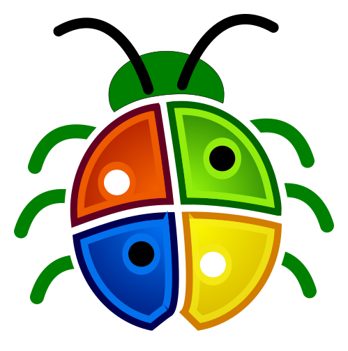

# Developer Documentation Overview

Welcome to the NoLimitConnect Developer Documentation.

This section provides everything you need to build, compile, and contribute to the NoLimitConnect project across all supported platforms.

---

### 🛠 Qt Setup and Recommended Version

Qt provides the graphical UI framework used by **NoLimitConnect**.  
All build environments **except Docker and Flatpak** require a local Qt installation.

Although most Qt 6.x.x versions work, it is recommended to use:

- **Qt 6.9.3 or newer**, due to the fix for:  
  **QTBUG-137407** — <https://qt-project.atlassian.net/browse/QTBUG-137407>

---

### Java Requirement

For Android builds, the recommended Java version is:

- **Java 17**

---

### Qt Installation

You can download and install the Qt SDK from:

➡️ **<https://www.qt.io/download>**

*Note:*  
The **Community Edition** may be less visible on the site and could require navigating through several pages to locate it.

Preferred Qt version: 6.9.3 (6.7.3 for Raspberry Pi only if QCreator has errors when ran)

---

## Build Instructions by Target OS

### Android

[**Build for Android**](build-target-android.md)

---

### Raspberry Pi

[**Build for Raspberry Pi**](build-target-raspberry-pi.md)

---

### Linux

[**Build for Linux**](build-target-linux.md)

---

### Windows

[**Build for Windows**](build-target-windows.md)

---

## 🛠 Build Environments

- **Windows Build Environment**  
  Setup instructions for Visual Studio, SDKs, and the Windows-specific toolchain.
 [**Setup Windows**](Setup_Windows_Build_Environment.md)

- **Linux Build Environment**  
  Required libraries, dependencies, and system configuration.
 [**Setup Linux**](Setup_Linux_Build_Environment.md)

- **Docker Build Environment**  
  Build system isolation using containerized environments.
  [**Setup Docker**](Setup_For_Docker_Image_Build_Environment.md)

- **Flatpak Build Environment**  
  Setup uild system flatpak environments.
  [**Setup Flatpak**](Setup_Flatpak_Build_Enviroment.md)

---

## 🧱 Compilation Guides

- [**Compile with Visual Studio**](Compile_NoLimitConnect_VisualStudio.md)
- [**Compile with QCreator**](Compile_NoLimitConnect_QCreator.md)
- [**Compile with Docker**](Compile_NoLimitConnect_Docker.md)
- [**Compile with Flatpak**](Compile_NoLimitConnect_Flatpak.md)

Each guide includes step-by-step instructions for configuring your development environment and successfully building the project.

---

## Contributing

My name is Brett R. Jones, and NoLimitConnect is a long-term passion project that I have been building independently for many years. I continue to work full-time, and while I’m deeply committed to developing this platform, my professional environment strongly discourages any form of social networking activity — even outside of work. 

This creates an ironic situation for a developer of a social platform:  
I can build the system, but I cannot effectively participate in the public-facing side of it.

Because of this, I am looking for someone who would be interested in serving as a **community-facing representative** for the NoLimitConnect project. If you’re passionate about privacy, decentralized communication, or open-source communities, your help would be incredibly valuable.

You can contact me at:

**bjones.engineer(AT)gmail.com**

### Possible Responsibilities

- Setting up or moderating community chat channels  
- Helping organize bug tracking and user feedback  
- Acting as a representative of the project while respecting its privacy-focused mission  
- Assisting with documentation, onboarding guides, or release announcements  

### Project Principles

- Absolutely **no advertising or spam**, with the single exception of Hide.me VPN (recommended for users needing automatic port forwarding).  
- The project will remain privacy-first and user-controlled — no analytics, tracking, or monetization that compromises user autonomy.

---

Any level of involvement — whether technical, social, or organizational — is appreciated.  
Your support can help ensure the long-term growth and success of NoLimitConnect.
