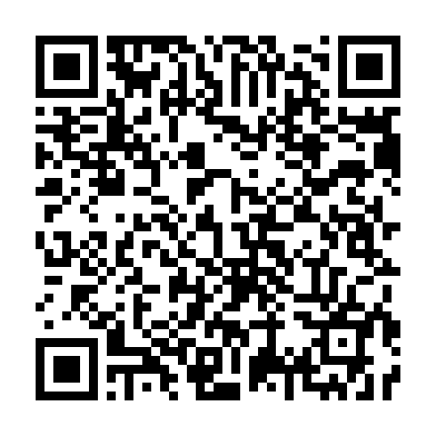
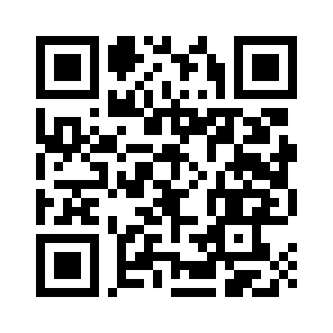

## 🙌 Why Donate?

NoLimitConnect takes a strong stance on:

- ❌ No ads  
- ❌ No analytics tracking  
- ❌ No data harvesting  
- ❌ No corporate backing  
- ✔ 100% user-controlled communication  
- ✔ 100% open-source  

Your donation helps sustain the project so development can continue without compromising on privacy or freedom.

---

# 🟣 Monero (XMR)

Monero provides industry‑leading privacy for both sender and receiver.

**XMR Address:**  
```
83c8TFe3JdgRcnCDBu7WgZA8cUr7x2Qs597x8gZwtoR6YJbZRZNuUgF8MF2HTkqoWPbHA92m22gcg72FPmzo6jfCJhPo4g5
```

**Scan to Donate:**  


[🟣 Donate with Monero](monero:83c8TFe3JdgRcnCDBu7WgZA8cUr7x2Qs597x8gZwtoR6YJbZRZNuUgF8MF2HTkqoWPbHA92m22gcg72FPmzo6jfCJhPo4g5)

---

# 🟠 Bitcoin (BTC)

Bitcoin is widely supported and simple for donors to use.  
This address is dedicated exclusively to NoLimitConnect donations.

**BTC Address:**  
```
bc1qydxh3cqtqhsve3p7yjkukvwrk4psnurdndz9q2
```

**Scan to Donate:**  


[🟠 Donate with Bitcoin](bitcoin:bc1qydxh3cqtqhsve3p7yjkukvwrk4psnurdndz9q2)

---

## Thank You ❤️

NoLimitConnect exists because people like you value privacy, freedom, and independent technology.  
Your support helps ensure it stays that way.

---

## Contributing in other ways

My name is Brett R. Jones, and NoLimitConnect is a long-term passion project that I have been building independently for many years. I continue to work full-time, and while I’m deeply committed to developing this platform, my professional environment strongly discourages any form of social networking activity — even outside of work. 

This creates an ironic situation for a developer of a social platform:  
I can build the system, but I cannot effectively participate in the public-facing side of it.

Because of this, I am looking for someone who would be interested in serving as a **community-facing representative** for the NoLimitConnect project. If you’re passionate about privacy, decentralized communication, or open-source communities, your help would be incredibly valuable.

You can contact me at:

**bjones.engineer(AT)gmail.com**

### Possible Responsibilities

- Setting up or moderating community chat channels  
- Helping organize bug tracking and user feedback  
- Acting as a representative of the project while respecting its privacy-focused mission  
- Assisting with documentation, onboarding guides, or release announcements  

### Project Principles

- Absolutely **no advertising or spam**, with the single exception of Hide.me VPN (recommended for users needing automatic port forwarding).  
- The project will remain privacy-first and user-controlled — no analytics, tracking, or monetization that compromises user autonomy.

