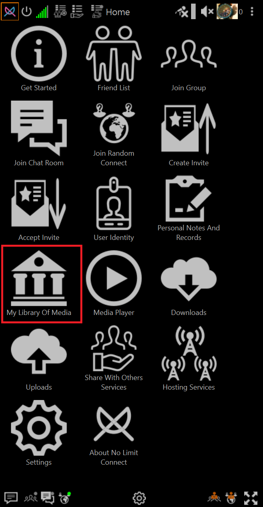
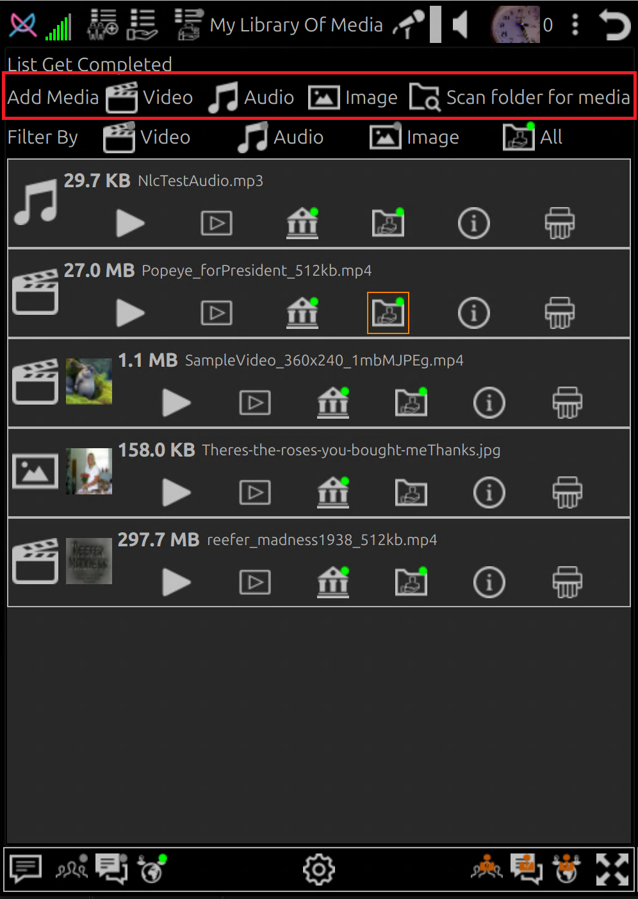
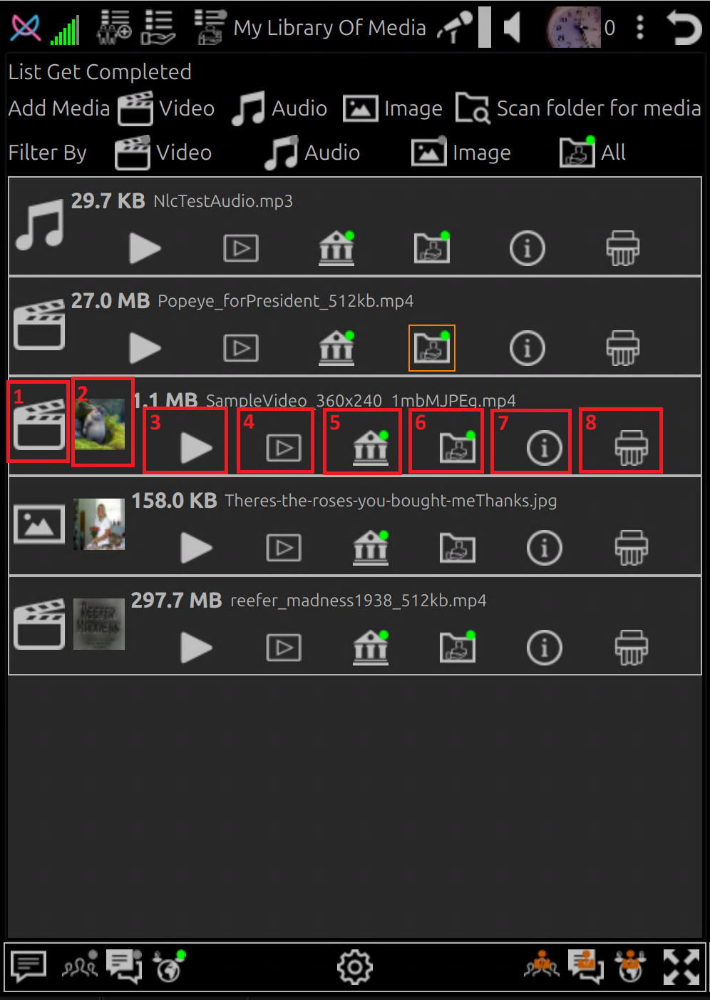

# How-To Add Files to My Library

## Open Library

Click **My Library Of Media Files**

## Use A Add Files button to add files to library

## File List Item Buttons

1. **Media Type Icon**

    A Icon that indicates the media file type

2. **Thumbnail**

    If media type is image or in the same folder as the media file a PNG image file with same file name exist then
    a thumbnail is generated

3. **Play using NLC**

    Play the media file using NLC built-in media player or image viewer (no calls to internet to give away information)

4. **Play using default application**

    Opens the file using the default application for the file extenstion

5. **Add or Remove file from library**

    - 🟢 File is in library
    - No 🟢 indicator means file will be removed from library on exit from library

6. **Share File**

    - 🟢 File is shared (if Share Files plugin permission is not set to disabled)
    - No 🟢 indicator means file is **NOT** shared

7. **Show file information**

    When clicked show information about the file including path and a larger view of thumbnail (if exists)

8. **Shred file**

    Remove file from NLC and shred it

    Shred will write random data to the whole file before deleting it.

    Files that are not shredded can often be recovered using disk utilities

