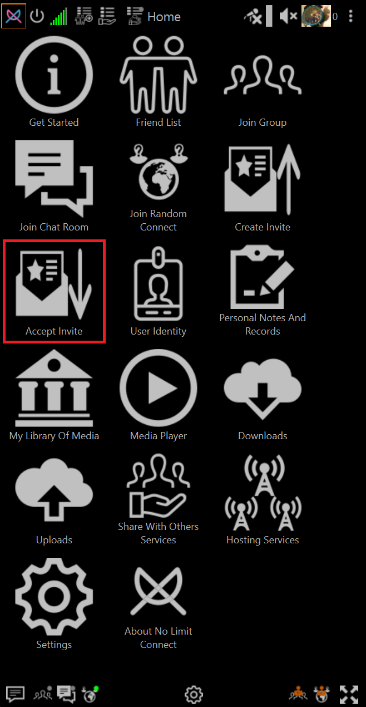
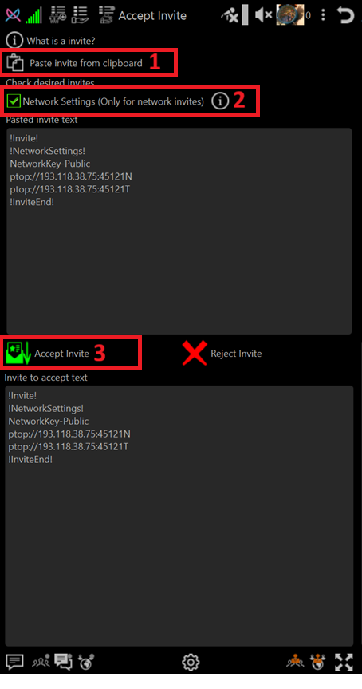
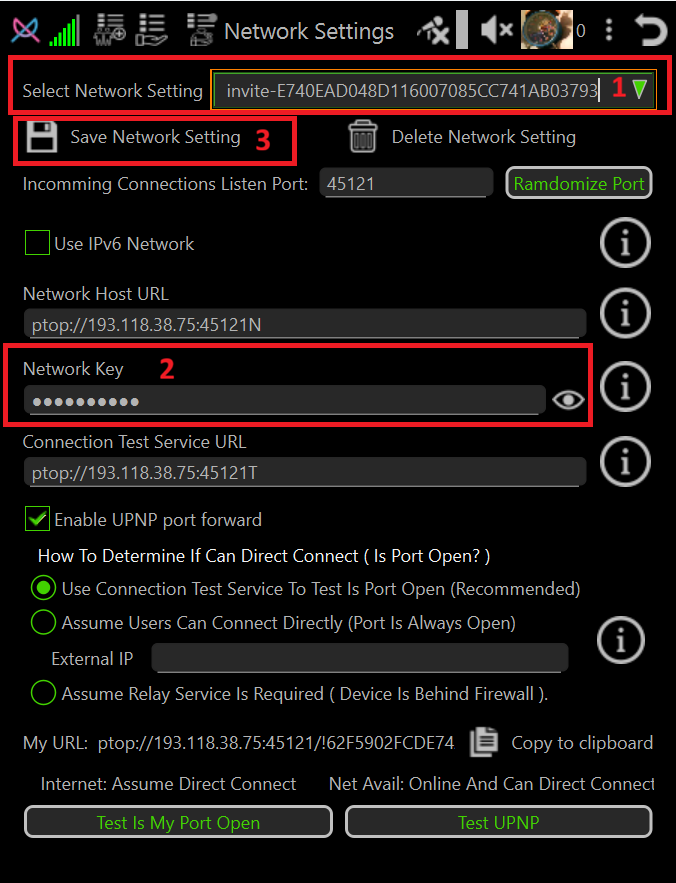

# How-To Accept A Network Invite 

## Open Create Invite

Click **Accept Invite** on home page

## Choose Accept Invite Options

3. **Paste invite text from the clipboard button**

    Copy invite text you were sent to clipboard (Highlight and Ctrl+C on most system)

    Click the **Paste invite from clipbard**

2. **Select Network Invite**

    Check the box **Network Settings (Only For Network invite)

3. **Accept the invite**

    Click **Accept Invite**
    
    Network settings page will popup with the accepted network settings.

## Save Network Setting

1. **Optionally change the network setting name to something you can remember**

    CLick mouse in Select Network Settings field and change it

2. **Private Network Key Information**

    If your invite text contains **NetworkKey-Private** instead of **NetworkKey-Public** then
    be sure to paste the Network Key you were sent into Network Key field before pressing **Save Network Settings**.

    For more information about public and private network keys please read **Encryption Overview**

    ➡️ [Encryption Overview](../encryption-overview.md)

3. **Save Network Setting**

    CLick **Save Network Setting** button.

    Immediately exit application and restart it to avoid possible ban as hacker.

