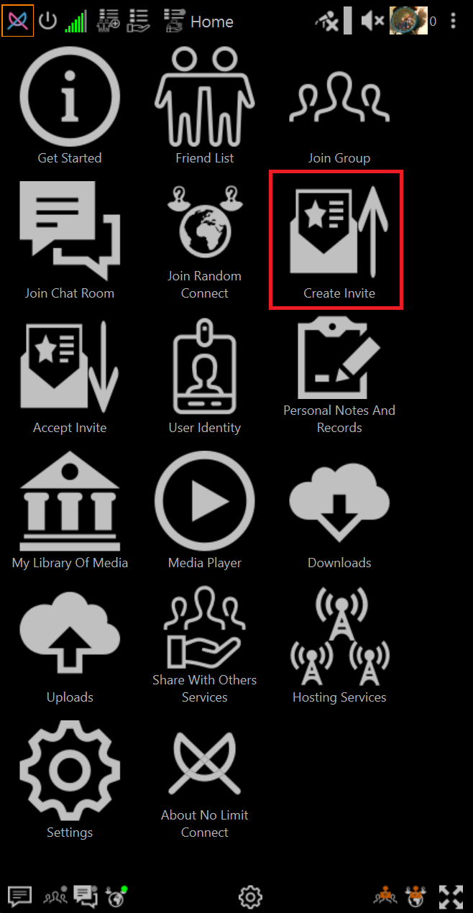
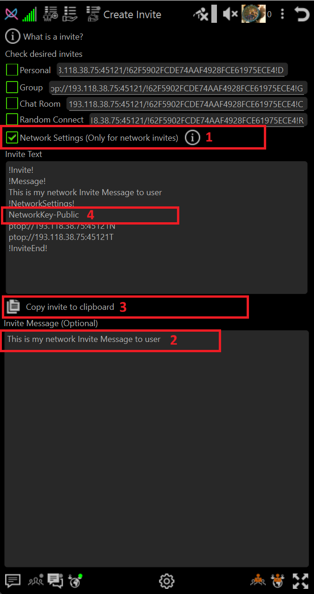

# How-To Create A Network Invite 

## Open Create Invite

Click **Create Invite** on home page

## Choose Invite Options

1. **Select Network Invite**

    Check the box **Network Settings (Only For Network invite)

2. **Optional Add A Personal Message**

    If desired, type the meessage. The message can be anything but in general it is useful to convey what the theme of the network is.

3. **Copy the invite text using the clipboard button**

    Click the **Copy invite to clipbard**
    
    Send the invite text to persons you want to join through any texting or email or post in chatroom etc.

4. **Private Key Information**

    If your invite text contains **NetworkKey-Private** instead of **NetworkKey-Public** then
    the **Network Key** you have set in network settings will need to be sent seperately to the people you have invited.

    For more information about public and private network keys please read **Encryption Overview**

    ➡️ [Encryption Overview](../encryption-overview.md)

## How-To accept a network invite

➡️ [How-To Accept Invite](howto-network-invite-accept.md)

