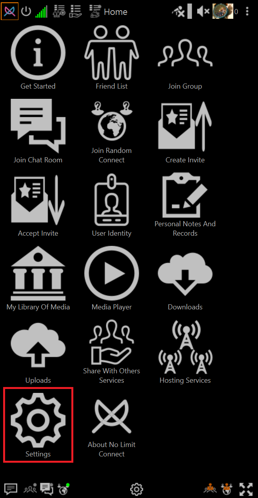
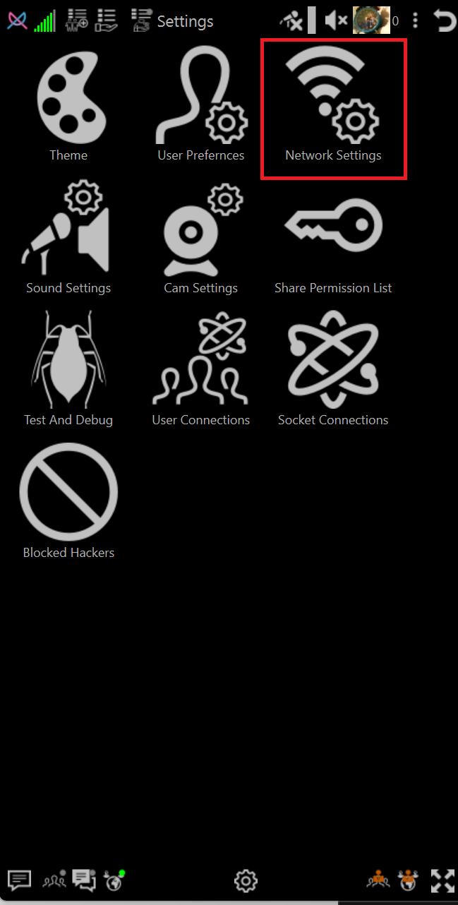
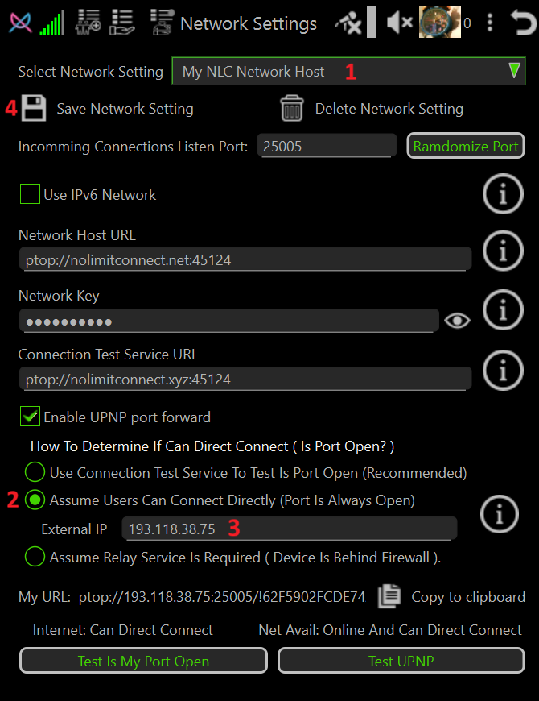
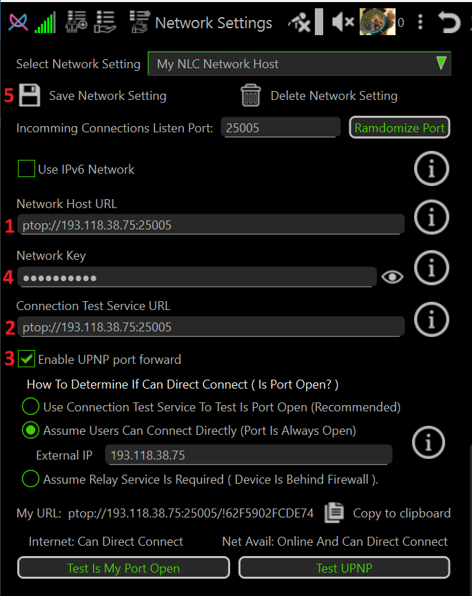

# How to Set Up and Configure a NoLimitConnect Network Host

This guide describes how to compile, configure, and run a NoLimitConnect (NLC) Network Host on a Linux system.

---

## Compile and Run NoLimitConnect on Linux

**Flatpak** is the recommended method for building and running NoLimitConnect for the following reasons:

- Fewer build and runtime steps
- Reduced disk space usage (no need to install the Qt SDK, Qt Creator, etc.)
- A consistent runtime environment that minimizes hardware and OS differences

### Documentation
- ➡️ [Set Up Flatpak Build Environment](../developer-docs/Setup_Flatpak_Build_Enviroment.md)  
- ➡️ [Compile and Run NoLimitConnect Using Flatpak](../developer-docs/Compile_NoLimitConnect_Flatpak.md)

---

## Determine Your Public IP Address

You will need the IP address that is visible to the internet (your **public IP**). This value will later be entered into the **External IP** field in Network Settings.

### Ways to Find Your Public IP
- Use a search engine (for example, search for *"what is my IP address"*)
- Visit https://whatismyipaddress.com  
  (This site also provides information about your location and internet provider)

---

## Open the Network Settings Page

1. Click **Settings**  
   

2. Click **Network Settings**  
   

---

## Configure Network Name and External IP

1. Enter a name of your choice in the **Select Network Setting** field.
2. Select the radio button **Assume Users Can Connect Directly**.
3. Enter your public IP address in the **External IP** field.
4. Click **Save Network Setting**.
5. Restart NoLimitConnect.
6. Verify that all Network Status Bars are **green**.

---

## Configure Network Host and Connection Test URLs

Network Host and Connection Test URLs use the following format:

ptop://<IP address or domain name>:<network port>

### Examples
Using a public IP address:

ptop://193.118.38.75:25005

Using a domain name:

ptop://mynetworkhost.com:25005

> **Note:** If you purchased a domain name substitute mynetworkhost.com with your domain name.

If you prefer a different port number than the current one then click **Randomize Port** until a suitable port is assigned.

> **Note:** Replace `25005` with the port number assigned by NoLimitConnect.

### Steps
1. Open **Network Settings** again.
2. Enter your **Network Host URL**.
3. Enter your **Connection Test URL**.
4. If you have a **static IP address**, you may optionally disable **Enable UPnP Port Forward** to speed up the network test phase during startup.
5. Optionally change the **Network Key**.

> **Important — Network Key Behavior**
>
> - Changing the Network Key improves security but has important side effects.
> - The Network Key is **not included** in Network Invites and must be shared separately.
> - Any connection attempt to user or host using a different Network Key will result in the connecting user being banned as a hacker.
> - The only way to remove such a ban is to restart NoLimitConnect on the system(s) that issued it.
> - Changing the Network Key is recommended **only for private networks**.

6. Click **Save Network Setting**.
7. Restart NoLimitConnect.
8. Verify that all Network Status Bars are **green**.

---

## Enable Network Host and Connection Test Permissions

Set the desired permission level for:
- **Host No Limit Network**
- **Connection Test**

Optionally configure permissions for:
- **Host ChatRoom**
- **Host Group**
- **Host Random Connect**

> **Bandwidth Notes**
>
> - **Host No Limit Network** and **Connection Test** have low bandwidth requirements.
> - **Host ChatRoom**, **Host Group**, and **Host Random Connect** may require high bandwidth when relay services are used.

> **Recommendation**
>
> For initial setup, it is easiest to set permissions to **Anybody** until appropriate friendship levels are established for each user.

➡️ [How To Set Plugin Permission Levels (who can access what)](howto-plugin-permission-levels.md)

---
