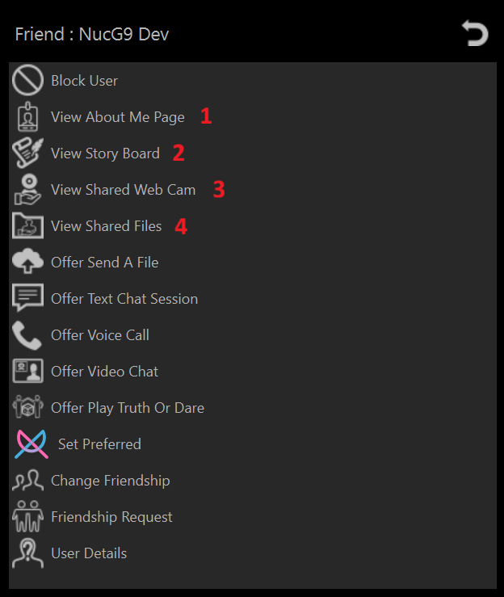

# Permission Levels Explained

Permission Levels are how you control who has access to what.

From Highest to Lowest Access these permission Levels are:

1. **Administrator**   
   Can access any Shared Plugin Resource except those set to disabled  

2. **Friend**  or   
   Can access any Shared Plugin Resources set to Permission Level Friend, Guest or Anybody 

3. **Guest**   
   Can access any Shared Plugin Resources set to Permission Level Guest or Anybody  
   *NOTE: people that join the host you are joined to are automatically elevated from Anybody to Guest if you have not set a permission level for that person*

4. **Anybody**   
   Can only access Shared Plugin Resources set to Permission Level Anybody 

5. **Ignore** 
    Can **NOT** access anything and if a attempt of direct connect to you then that connection is immediately dropped. 

If a plugin is set to Disabled or ignored then that plugin is completely disabled. 

## Shared Plugin Resourses

These are plugins that multiple people can access at the same time (basically acts like a server).

1. **About Me Page**

    A single simple web-like page for a bit about yourself that people with sufficent permission level can view

2. **Story Board**

    A blog posting page that people with sufficent permission level can view

3. **Shared Web Cam**

    A web cam server (Often used as a "nanny cam" or a security camera)

4. **Shared Files**

    People with sufficent permission can either download or stream these media files

## How To Limit Peoples Permission to access your plugins

➡️ [How To Set User Permissions](howto-user-permission-levels.md)

## How To Set Plugin Permissions

➡️ [How To Set Plugin Permissions](howto-plugin-permission-levels.md)

