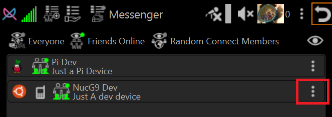
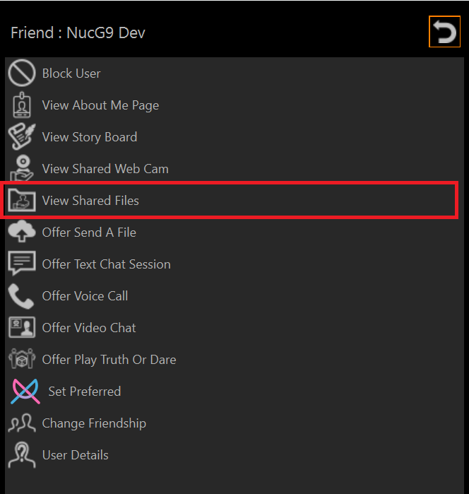
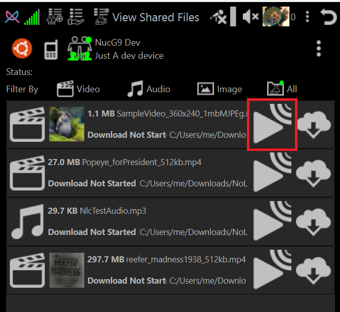
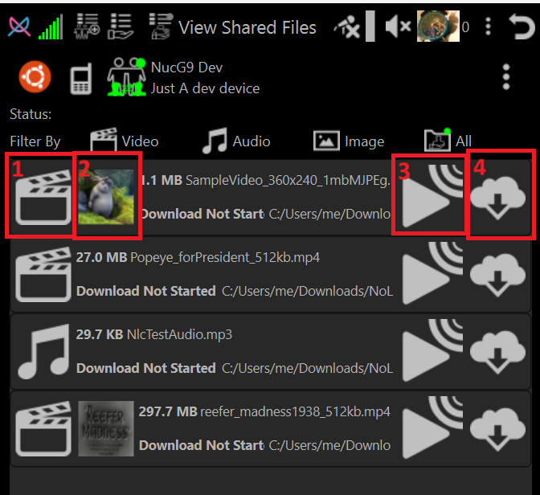

# How-To Play (Stream) or Download file other users have shared

## Click Person Menu

## Select View Shared Files

## Click Play Stream icon

Movie will play in NLC

## Shared File entry buttons

1. **Media Type Icon**

    A Icon that indicates the media file type. When clicked shows information about the file

2. **Thumbnail**

    If available shows a thumbnail associated with the media. If not available the button is hidden

3. **Stream (Play meadia) in NLC**

    Play the media file using NLC built-in media player or image viewer. The file is not downloaded to your device.

4. **Download File**

    Download and put file in Library
