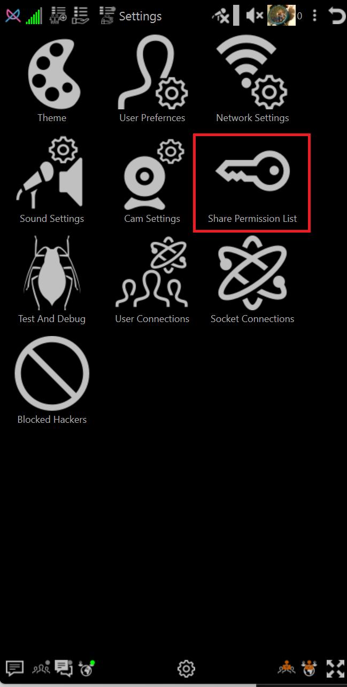
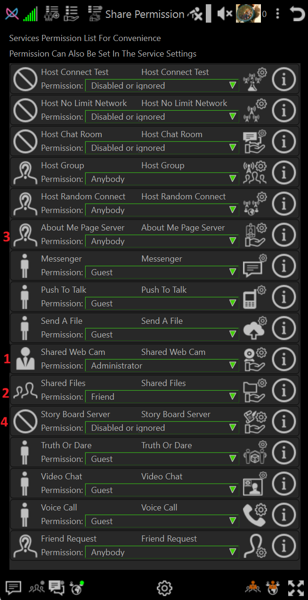

# How To Set Plugin Permission Level

## Example of plugin permissions

As a example:

 - 1 - I want to share web cam only with my cell phone

 - 2 - I want to share media files with friends

 - 3 - I want to share about me page with anyone

 - 4 - I want to disable storyboard because I do not want to make a blog

## Open Plugin Permission List

A. Click Settings

B. Click Permission List

## Set Permission Levels To desired level

## Set Your Cell Phone to have Administrator privilege

➡️ [How To Set User Permissions](howto-user-permission-levels.md)