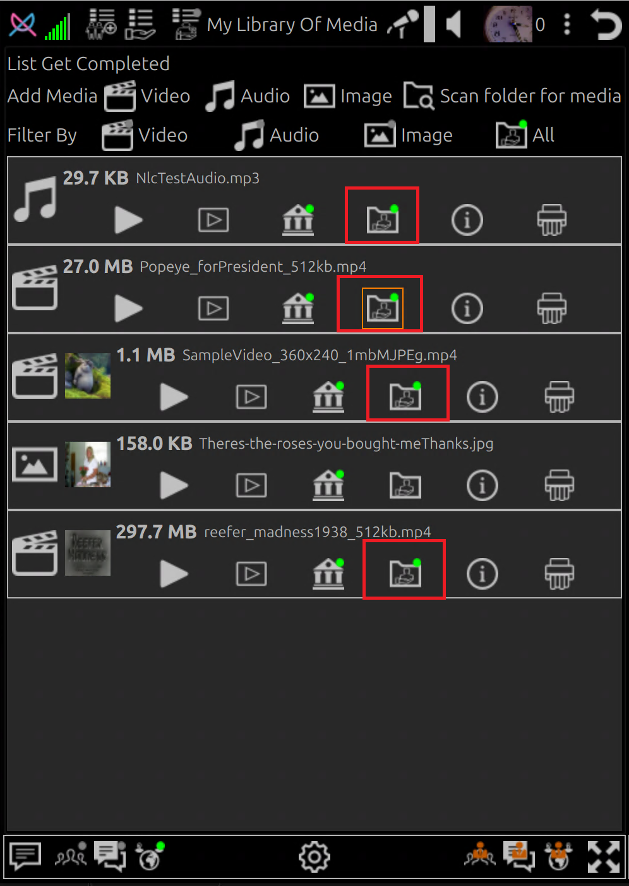

# How-To Share Media Files

## Change Share Files Plugin to the desired permission level

➡️ [How To Set Plugin Permissions](howto-plugin-permission-levels.md)

## Add the files you plan to share to Library

➡️ [How To Add Files To Library](howto-add-files-to-library.md)

## Enable Share of the desired files

1. Click the share file icon   to toggle share file

    - 🟢 File is shared (If Share Files plugin is not disabed)
    - No 🟢 indicator means file is **NOT** shared

## View and Play or Download Files from another device

➡️ [How To Play or Download Files](howto-play-or-download-files.md)