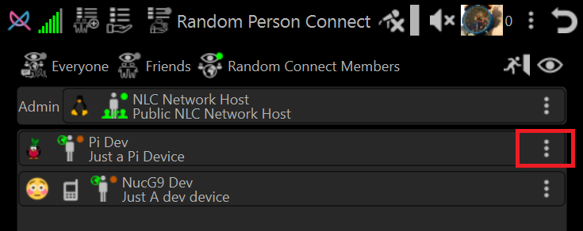
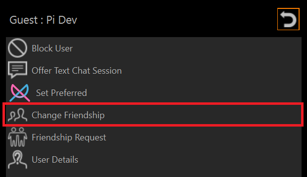
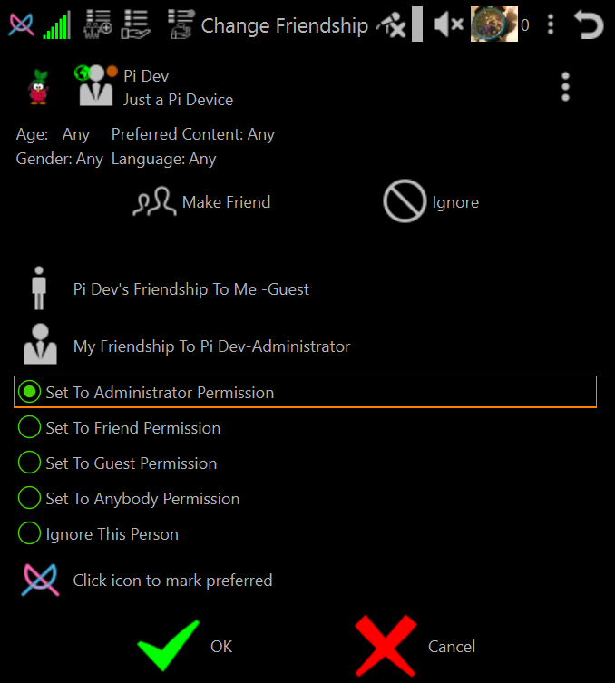
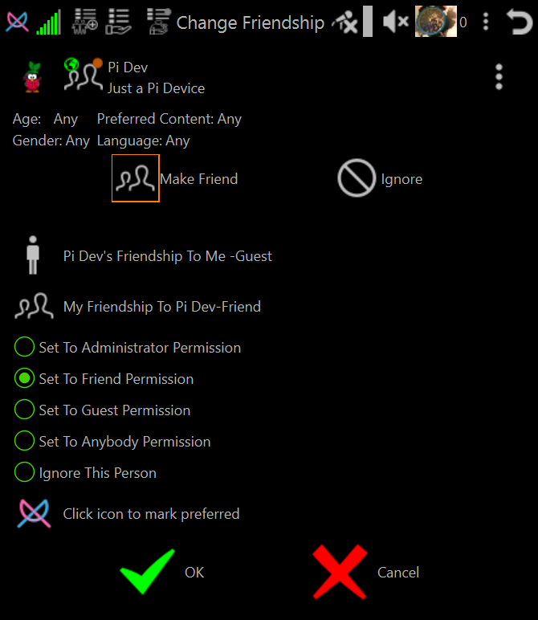
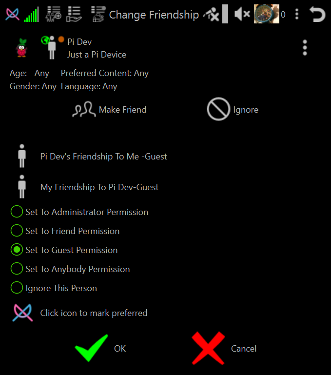
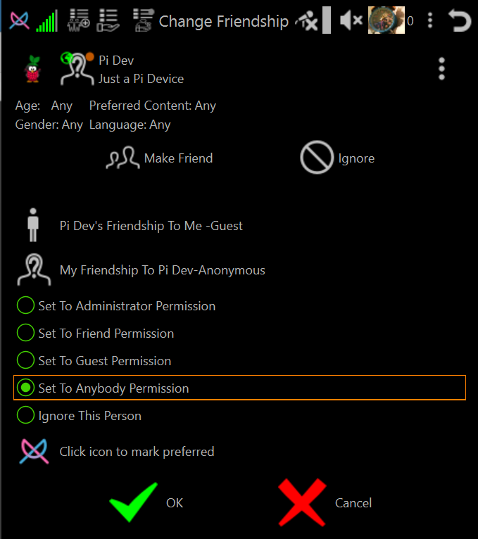
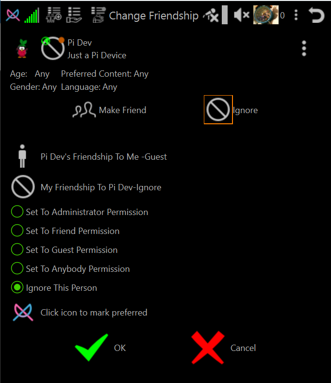
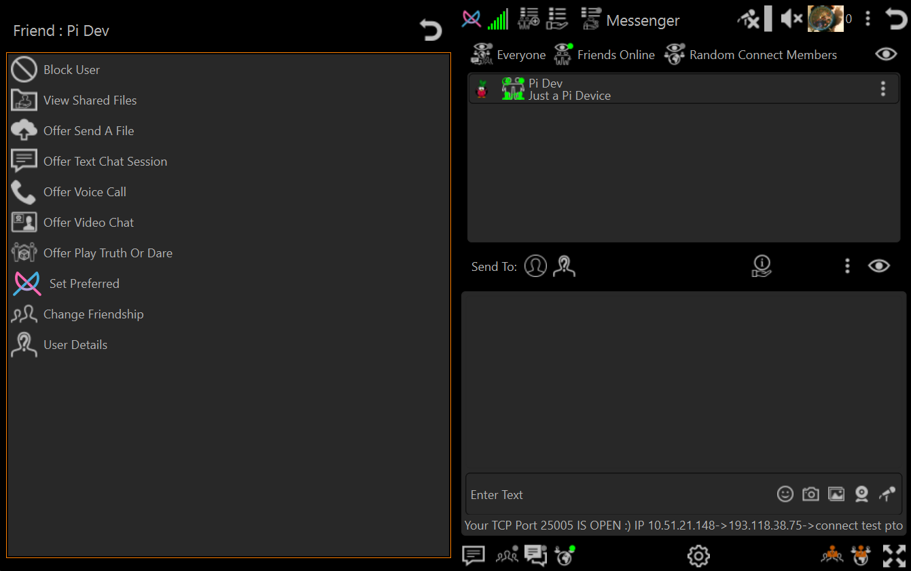

# How To Set User Permission Levels (including how to block a user)

## Permission Level Overview.

➡️ [Permission Levels Explained](howto-permission-levels.md)

## Set Permission Level Of Peer Person

1. Select Person Menu (The 3 dots at end of Person List Entry)

2. Select Change Friendship Menu Item

3. Select the desired permission level

## Administrator Permission

## Friend Permission

NOTE: Clicking **Make Friend** or selecting radio button **Set To Friend Permission** are the same selection action

## Guest Permission

NOTE: If person joins the same host as you and were Anybody level they are automatically elevated to guest permission

## Anybody Permission (Default permission for people you have not set the permission level for)

## Ignore Permission (Block User)

NOTE: Clicking **Ignore** or selecting radio button **Ignore This Person** are the same selection action

# Friend <-> Friend Permission Levels (Both You And Your Friend Have Set Permission Level To Friend)

1. Frienship Icon in Persons Lists changes from 

to
.

2. NLC will attempt to make a direct connection from you to your friend.

    If direct connection is achieved then neither you or your friend need to join any host to communicate with each other.

3. Person Menu will show all actions you can take (mostly determined by your friends plugin permission levels).

4. Your friend will show in Messenger and Friends List.

