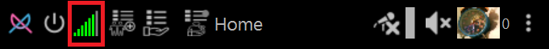

# Port Forwarding (Open A Network Port) Guide

Port forwarding allows your device to accept incoming connections directly from other NoLimitConnect users.  
Direct connections provide the best experience and allows you to host services.

---

# 📡 Why Port Forwarding Matters

NoLimitConnect attempts to connect users directly whenever possible.  
However, most home networks use **NAT (Network Address Translation)**, which blocks unsolicited inbound traffic.

If your port is not open:

- You can still use NoLimitConnect  
- A host you connect to will forward your traffic automatically  
- Performance may be slower compared to direct mode
- You cannot become a host but can still share, stream etc. with others.

Opening your port allows:

- Direct peer-to-peer connections  
- Hosting groups, chat rooms, random connect and private networks  
- Better speed and reliability  

---

# 🔍 Step 1 — Check Your Port Status

Your connection bar color indicates the current network mode:

- 🟡 **Yellow** – testing your network 
- 🟠 **Orange** – port closed, using relay  
- 🟢 **Green** – port open, direct connection enabled  

You can view the test result in the **Network Status Bars** in the title bar of the app.

If the bars are orange proceed to Step 2

---

# 🌐 Step 2 — Enable UPnP (Automatic Open A Port Method)

## 🚀 Option 1 — The easy way

1. Install hide.me VPN
→ [VPN (Hide.me)](vpn.md)
2. Restart NoLimitConnect

## 🚀 Option 2 — The hard way

Most modern routers support **UPnP (Universal Plug and Play)**.

1. Open your router’s admin page  
2. Find **UPnP** settings  
3. Enable UPnP  
4. Restart your router  
5. Restart NoLimitConnect

If UPnP works, the connection bar should turn **green** shortly after startup.

---

# 🚧 Step 3 — Manual Port Forwarding (Advanced Method)

If UPnP is not available:

1. Open your router’s admin page  
2. Find **Port Forwarding**, **Virtual Server**, or **NAT** settings  
3. Add a new rule:

| Setting | Value |
|--------|-------|
| Port | Your NLC port (shown in network settings) |
| Protocol | TCP |
| Internal IP | Your device's LAN IP address |
| Description | “NoLimitConnect” |

4. Save and reboot the router  
5. Restart NoLimitConnect

Your status bar should turn **green** once incoming traffic is allowed.

---

# 📱 Mobile Hotspots and LTE Devices

Most mobile carriers use **carrier-grade NAT**, which does **not** support port forwarding.

In these cases:

- Direct mode is not possible without a VPN that supports UPNP
- Relay mode will be used automatically if port is not open
- NoLimitConnect will still function normally

---

# 🛠 Troubleshooting

If your port still appears closed:

- Restart your router  
- Reboot your device  
- Ensure no VPN or firewall is blocking the port  
- Ensure you forwarded the correct internal IP address  
- Verify that two devices on the same network cannot test each other  
- Try a different LAN cable or Wi-Fi band (2.4 GHz vs 5 GHz)  

---

For the best performance, use UPnP or manual forwarding on a stable home router.
