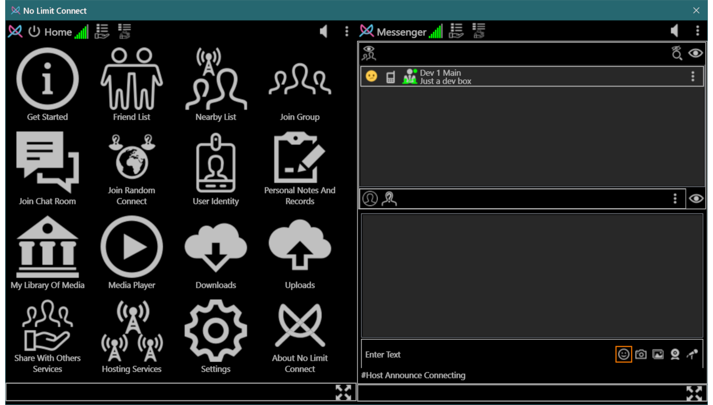
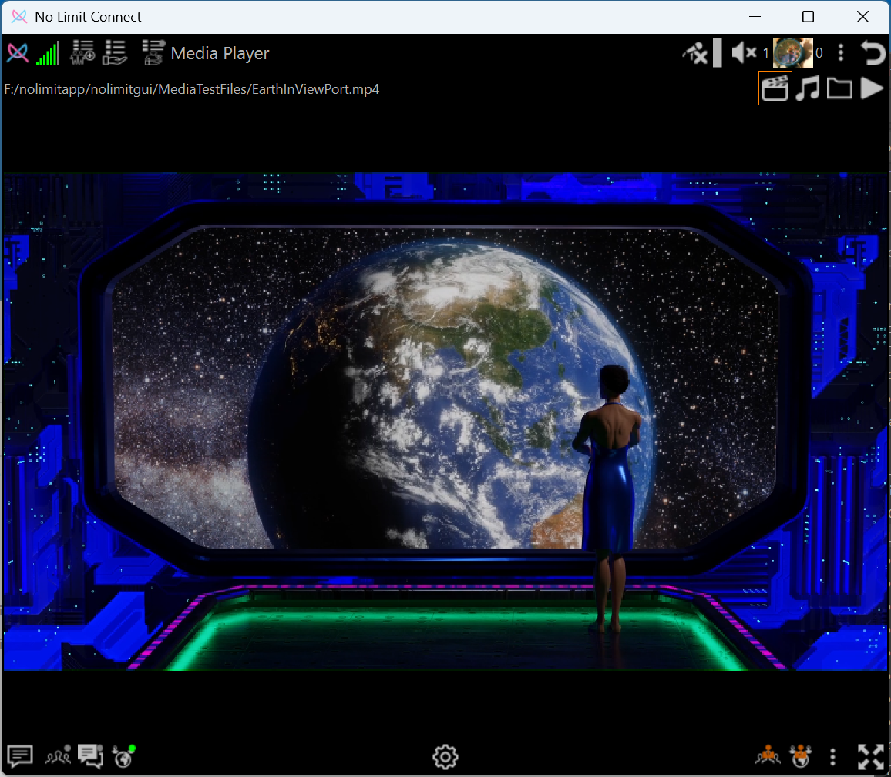

# Application Screenshots

A visual overview of the NoLimitConnect interface.  
Click any image to view the full-size version.

---

## Main Application Views

### Screenshot 1

---

### Screenshot 2

---

### Screenshot 3

---

## Permissions Settings

Each plugin permission in NoLimitConnect can be configured to one of the following levels:

Disabled — The plugin is completely disabled and inaccessible to all users.

Anonymous — Anyone, even users who are not identified, may access the plugin.

Guest — Only connected users marked as Guest or above may access the plugin.

Friend — Only users on your Friends list (or Admins) may access the plugin.

Admin — Only Admin-level users may access the plugin.

If you are setting up a completely seperate network then you will need to enable
Host No Limit Network and Host Connect Test.
In cases where you just want to host your own Group, Chat Room or Random Connect Host then
just the appropriate host needs to be enabled.
All hosts need a open port for users to connect to.

