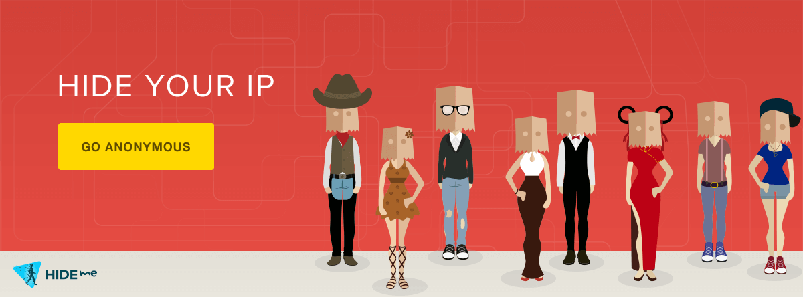

# Recommended VPN: Hide.me

Using a VPN can greatly improve connectivity in NoLimitConnect, especially when your network or ISP restricts incoming ports.  
Hide.me VPN is one of the few VPN providers that fully supports:

- **Automatic Port Forwarding**
- **UPnP**
- **OpenVPN & WireGuard**
- **Strict No-Logs Policy**

These features make Hide.me an ideal choice for users who want direct connections without configuring routers manually.

---

# 🛡 Why a VPN Helps With NoLimitConnect

Some Internet service providers:

- Block inbound traffic  
- Use Carrier-Grade NAT (CGNAT)  
- Prevent manual port forwarding  
- Provide restrictive NAT types  

When this happens, NoLimitConnect must use a **relay** instead of a direct connection.

A VPN with port forwarding can solve this by:

- Giving you an externally accessible port  
- Providing a consistent, open NAT  
- Allowing direct peer connections  
- Improving performance and hosting reliability  

---

# 🔌 Hide.me Features That Benefit NLC Users

## **1. Automatic Port Forwarding**
Hide.me can assign you a forwardable port instantly.  
No router configuration needed.

## **2. UPnP Support**
Applications like NoLimitConnect can request and manage ports automatically.

## **3. Strong Privacy**
Hide.me is certified **no-logs** and independently audited.  
Your IP address, identity, and activities are not tracked.

## **4. Stable Hosting**
With a forwardable VPN port, you can host:

- Group servers  
- Chat Rooms  
- Random Connect  
- Direct P2P sessions  

even on networks that normally block it.

---

# 🧭 Get Started with Hide.me

Click the banner above to learn more or sign up.

> **Note:** Hide.me is the *only* recommended external service on this site.  
> NoLimitConnect does not receive user data from Hide.me.

---

# 📝 Tips for Best Performance

- Select a VPN server close to your physical region  
- Enable automatic reconnection  
- Use WireGuard for best speed  
- Keep NoLimitConnect running after the VPN connects  
- Verify your connection bar shows **green** after port assignment

---

# 🔐 Important Privacy Note

Using a VPN **does not weaken** NoLimitConnect’s encryption.  
Your communication remains:

- End-to-end encrypted  
- Peer-verified  
- Never routed through a central server  
